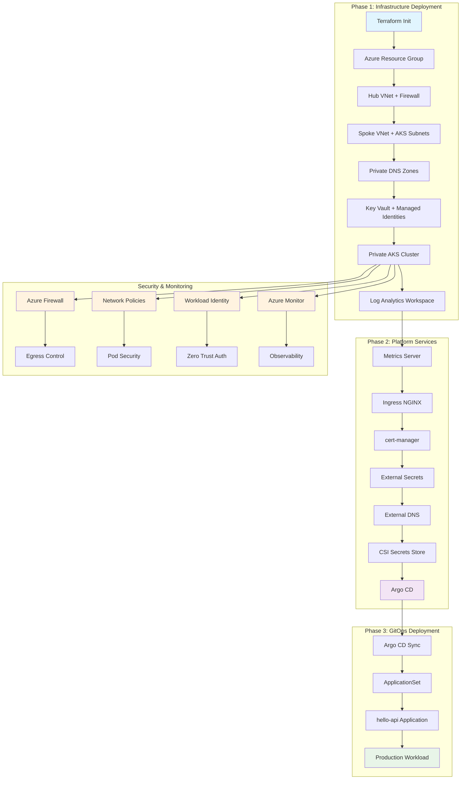

# Azure AKS Zero-Trust Platform

A production-grade Azure AKS platform implementing zero-trust security principles with Terraform infrastructure-as-code and Argo CD GitOps.

## 🏗️ Architecture

This platform consists of two sibling repositories:

- **`infra/`** - Terraform IaC for Azure networking, identities, AKS (private), Azure DNS, Key Vault, baseline add-ons, and Argo CD bootstrap
- **`gitops/`** - Argo CD apps repository with sample Go API application and ApplicationSets

## 📊 Deployment Flow



## ✨ Latest Updates

- **Latest Provider Versions**: azurerm ~> 4.0, kubernetes ~> 2.0, helm ~> 3.0
- **Kubernetes 1.30** support with modern security features
- **Enhanced Monitoring**: OMS Agent with Log Analytics integration
- **Updated Helm Charts**: Latest versions of all platform services
- **Improved Security**: Enhanced Key Vault and RBAC configurations

## 🔒 Zero-Trust Security Features

- **Private AKS API** - No public endpoint, admin access via `az aks command invoke`
- **Hub-Spoke Network** - Centralized security with Azure Firewall Premium
- **Restrictive Egress** - Azure Firewall with allow-list rules
- **Workload Identity** - OIDC-based authentication for all add-ons
- **Network Policies** - Cilium-based pod-to-pod communication control
- **Pod Security Admission** - Enforced security standards
- **Azure AD RBAC** - Integrated identity and access management

## 🚀 Quick Start

### Prerequisites

- **Terraform >= 1.12** with latest provider versions
- **Azure CLI** with appropriate permissions
- **Task** (for orchestration)
- **Azure subscription** with Contributor/Owner permissions
- **Public DNS zone** in Azure for your domain

### 1. Bootstrap Remote State

```bash
cd infra/scripts
./bootstrap-backend.sh <resource-group> <storage-account> <container> <location>
```

### 2. Configure Variables

Update `infra/envs/prod/terraform.tfvars`:

```hcl
# Required variables
dns_zone_rg   = "rg-dns-prod"           # Your DNS zone resource group
dns_zone_name = "example.com"           # Your domain name
gitops_repo_url = "https://github.com/mhuzkhan/aks-gitops-demo"

# Optional variables (have sensible defaults)
location = "East US"
environment = "prod"
```

### 3. Deploy Infrastructure

```bash
cd infra/envs/prod
terraform init -backend-config="resource_group_name=..." -backend-config="storage_account_name=..." -backend-config="container_name=..." -backend-config="key=prod.tfstate"
terraform apply -auto-approve
```

### 4. Access Private Cluster

```bash
# Get cluster information
az aks command invoke -g <resource-group> -n <cluster-name> --command "kubectl get nodes"

# Access Argo CD
# URL: https://argocd.<your-domain>
# Password: kubectl -n argocd get secret argocd-initial-admin-secret -o jsonpath='{.data.password}' | base64 -d
```

## 📁 Repository Structure

```
├── infra/                       # Terraform Infrastructure
│   ├── modules/                 # Reusable Terraform modules
│   │   ├── hub/                 # Hub networking
│   │   ├── spoke/               # Spoke networking
│   │   ├── firewall/            # Azure Firewall
│   │   ├── natgw/               # NAT Gateway
│   │   ├── private_dns/         # Private DNS zones
│   │   ├── keyvault/            # Azure Key Vault
│   │   ├── identities/          # Managed Identities
│   │   ├── aks/                 # AKS cluster
│   │   ├── baseline/            # Baseline add-ons
│   │   └── argocd_bootstrap/    # Argo CD bootstrap
│   ├── envs/prod/               # Production environment
│   ├── scripts/                 # Bootstrap and utility scripts
│   └── Taskfile.yml             # Task orchestration
└── gitops/                      # GitOps Applications
    ├── apps/hello-api/          # Sample Go API
    ├── argocd/                  # Argo CD configurations
    └── docs/                    # Documentation
```

## 🛠️ Components

### Infrastructure Modules

- **Hub Network** - Centralized security and connectivity
- **Spoke Network** - AKS workload isolation
- **Azure Firewall** - Egress control and security
- **NAT Gateway** - Outbound connectivity
- **Private DNS** - Service discovery
- **Key Vault** - Secrets management
- **Managed Identities** - Workload authentication
- **AKS Cluster** - Private Kubernetes with zero-trust
- **Baseline Add-ons** - Platform services
- **Argo CD** - GitOps automation

### Platform Services

- **Metrics Server 3.13.0** - Resource metrics for HPA
- **Ingress NGINX 4.13.3** - Load balancing and ingress
- **cert-manager v1.18.2** - Automatic TLS certificate management
- **External Secrets 0.20.1** - Key Vault integration with Workload Identity
- **External DNS 1.19.0** - DNS record management with User-Assigned MI
- **CSI Secrets Store 1.5.4** - Key Vault CSI driver
- **CSI Key Vault Provider 1.7.1** - Azure Key Vault CSI provider
- **Argo CD 8.5.8** - GitOps continuous deployment

### Sample Application

- **hello-api** - Go microservice demonstrating:
  - Distroless container image
  - Health checks and probes
  - Horizontal Pod Autoscaler
  - Pod Disruption Budget
  - Network policies
  - TLS ingress
  - External secrets integration

## 🔧 Configuration

### Minimal Configuration Required

The platform now has **sensible defaults** for most variables. You only need to configure:

```hcl
# infra/envs/prod/terraform.tfvars
dns_zone_rg   = "rg-dns-prod"           # Your DNS zone resource group
dns_zone_name = "example.com"           # Your domain name
gitops_repo_url = "https://github.com/mhuzkhan/aks-gitops-demo"
```

### Default Values

- **Location**: East US
- **Environment**: prod
- **Kubernetes**: 1.30
- **Network**: Hub-spoke with Azure CNI Overlay
- **Security**: Cilium network policies, Pod Security Admission
- **Monitoring**: OMS Agent with Log Analytics
- **Node Pools**: System (tainted), Critical (tainted), App (general)

### DNS Configuration

Ensure you have a public DNS zone in Azure for your domain. The platform will:
- Create DNS records for Argo CD
- Configure external-dns for automatic DNS management
- Set up TLS certificates via cert-manager

## 📊 Monitoring and Observability

- **Azure Monitor** - Centralized logging and metrics
- **OMS Agent** - Container insights and monitoring
- **Log Analytics** - Query and analyze logs with 30-day retention
- **Defender for Cloud** - Security monitoring and compliance
- **Key Vault Monitoring** - Secret access and rotation tracking

## 🔐 Security Best Practices

1. **Network Security**
   - Private endpoints for all Azure services
   - Azure Firewall with restrictive egress rules
   - Network policies with Cilium
   - Pod Security Admission standards

2. **Identity and Access**
   - Workload Identity for all add-ons
   - Azure AD RBAC integration
   - Least privilege access principles
   - Regular access reviews

3. **Secrets Management**
   - Azure Key Vault for secrets storage
   - External Secrets Operator for K8s integration
   - CSI Secrets Store for pod-level secrets
   - Regular secret rotation

4. **Compliance**
   - Azure Policy integration
   - Defender for Cloud compliance
   - Audit logging enabled
   - Security scanning

## 🚨 Operations

### Accessing the Platform

```bash
# Private cluster access (no VPN required)
az aks command invoke -g <rg> -n <cluster> --command "kubectl get nodes"

# Get Argo CD admin password
az aks command invoke -g <rg> -n <cluster> --command "kubectl -n argocd get secret argocd-initial-admin-secret -o jsonpath='{.data.password}' | base64 -d"

# Access Argo CD
# URL: https://argocd.<your-domain>
```

### Task Commands

```bash
# Initialize backend
task init-backend RG=<resource-group> SA=<storage-account> CN=<container> LOCATION=<location>

# Deploy infrastructure
task tf-init
task tf-plan
task tf-apply

# Get cluster info
task kubeconfig
```

### Monitoring

- **Azure Portal** - Cluster health and resource status
- **Argo CD UI** - Application sync status and health
- **Azure Firewall** - Egress traffic logs and rules
- **Key Vault** - Secret access and rotation logs
- **Log Analytics** - Centralized query and analysis

### Troubleshooting

See `gitops/docs/OPERATIONS.md` for detailed troubleshooting guide.

## 🆕 Latest Features

### Provider Updates
- **azurerm ~> 4.0** - Latest Azure provider with enhanced security features
- **kubernetes ~> 2.0** - Improved AKS private cluster support
- **helm ~> 3.0** - Latest Helm provider with enhanced features

### Security Enhancements
- **Enhanced Key Vault** - Soft delete recovery and improved access policies
- **Workload Identity** - OIDC-based authentication for all add-ons
- **Network Policies** - Cilium-based pod-to-pod communication control
- **Pod Security Admission** - Enforced security standards

### Monitoring & Observability
- **OMS Agent** - Container insights and monitoring
- **Log Analytics** - 30-day retention with comprehensive logging
- **Azure Monitor** - Centralized metrics and alerting

### Developer Experience
- **Sensible Defaults** - Minimal configuration required
- **Task Orchestration** - Simplified deployment workflow
- **GitOps Ready** - Argo CD with automated sync

## 📚 Documentation

- [Operations Guide](gitops/docs/OPERATIONS.md) - Platform operations and troubleshooting
- [Infrastructure README](infra/README.md) - Infrastructure details
- [GitOps README](gitops/README.md) - Application deployment details

## 🤝 Contributing

1. Fork the repository
2. Create a feature branch
3. Make your changes
4. Test thoroughly
5. Submit a pull request

## 📄 License

This project is licensed under the MIT License - see the LICENSE file for details.

## ✅ Status

- **✅ Syntax Validated** - All Terraform code passes validation
- **✅ Latest Providers** - azurerm ~> 4.0, kubernetes ~> 2.0, helm ~> 3.0
- **✅ Security Hardened** - Zero-trust architecture with private AKS
- **✅ Production Ready** - Comprehensive monitoring and logging
- **✅ GitOps Ready** - Argo CD with automated deployment

## 🆘 Support

For support and questions:
- Create an issue in the repository
- Review the operations documentation
- Check Azure Monitor logs
- Consult the troubleshooting guide
