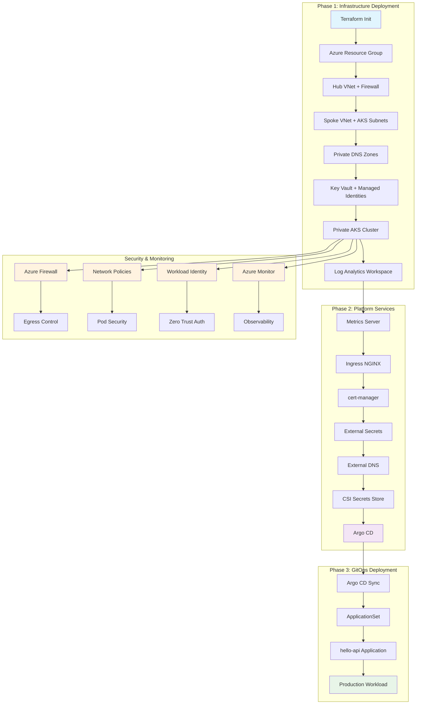

# Azure AKS Zero-Trust Platform

A production-grade Azure AKS platform implementing zero-trust security principles with Terraform infrastructure-as-code and Argo CD GitOps.

## 🎯 Overview

This repository provides a complete, production-ready Azure Kubernetes Service (AKS) platform with:

- **🔒 Zero-Trust Security**: Private AKS API, network isolation, Workload Identity, and comprehensive security policies
- **🏗️ Infrastructure as Code**: 10 Terraform modules managing 40+ Azure resources
- **🚀 GitOps Automation**: Argo CD for continuous deployment from Git
- **📊 Production Features**: Multi-zone HA, auto-scaling, monitoring, and disaster recovery
- **🛠️ Platform Services**: 7 Helm charts for essential Kubernetes add-ons
- **📦 Sample Application**: Production-ready Go API demonstrating platform capabilities

**Repository**: [https://github.com/mhuzkhan/aks-gitops-demo](https://github.com/mhuzkhan/aks-gitops-demo)

## 🏗️ Architecture

This platform consists of two sibling repositories:

- **`infra/`** - Terraform IaC for Azure networking, identities, AKS (private), Azure DNS, Key Vault, baseline add-ons, and Argo CD bootstrap
- **`gitops/`** - Argo CD apps repository with sample Go API application and ApplicationSets

## 📊 Deployment Flow



## ✨ Latest Updates

- **Latest Provider Versions**: azurerm ~> 4.0, kubernetes ~> 2.0, helm ~> 3.0
- **Kubernetes 1.30** support with modern security features
- **Enhanced Monitoring**: OMS Agent with Log Analytics integration
- **Updated Helm Charts**: Latest versions of all platform services
- **Improved Security**: Enhanced Key Vault and RBAC configurations

## 🔒 Zero-Trust Security Features

- **Private AKS API** - No public endpoint, admin access via `az aks command invoke`
- **Hub-Spoke Network** - Centralized security with Azure Firewall Premium
- **Restrictive Egress** - Azure Firewall with allow-list rules
- **Workload Identity** - OIDC-based authentication for all add-ons
- **Network Policies** - Cilium-based pod-to-pod communication control
- **Pod Security Admission** - Enforced security standards
- **Azure AD RBAC** - Integrated identity and access management

## 🚀 Quick Start

### Prerequisites

- **Terraform >= 1.12** with latest provider versions
- **Azure CLI** with appropriate permissions
- **Task** (for orchestration)
- **Azure subscription** with Contributor/Owner permissions
- **Public DNS zone** in Azure for your domain

### 1. Bootstrap Remote State

**From the repository root**:

```bash
task init-backend RG=<resource-group> SA=<storage-account> CN=<container> LOCATION=<location>
```

Or manually:
```bash
cd infra/scripts
./bootstrap-backend.sh <resource-group> <storage-account> <container> <location>
```

### 2. Configure Variables

Update `infra/envs/prod/terraform.tfvars`:

```hcl
# Required variables
dns_zone_rg   = "rg-dns-prod"           # Your DNS zone resource group
dns_zone_name = "example.com"           # Your domain name
gitops_repo_url = "https://github.com/mhuzkhan/aks-gitops-demo"

# Optional variables (have sensible defaults)
location = "East US"
environment = "prod"
```

### 3. Deploy Infrastructure

**From the repository root**:

```bash
# Initialize Terraform (with backend config)
task tf-init ARGS="-backend-config=resource_group_name=... -backend-config=storage_account_name=... -backend-config=container_name=... -backend-config=key=prod.tfstate"

# Plan changes
task tf-plan

# Apply infrastructure
task tf-apply
```

Or manually:
```bash
cd infra/envs/prod
terraform init -backend-config="resource_group_name=..." -backend-config="storage_account_name=..." -backend-config="container_name=..." -backend-config="key=prod.tfstate"
terraform apply -auto-approve
```

### 4. Access Private Cluster

```bash
# Get cluster information
az aks command invoke -g <resource-group> -n <cluster-name> --command "kubectl get nodes"

# Access Argo CD
# URL: https://argocd.<your-domain>
# Password: kubectl -n argocd get secret argocd-initial-admin-secret -o jsonpath='{.data.password}' | base64 -d
```

## 📁 Repository Structure

This is a **monorepo** containing both infrastructure and GitOps configurations:

```
aks-gitops-demo/
├── Taskfile.yml                     # Task orchestration (7 tasks) - Run from root!
├── README.md                        # This file
│
├── infra/                           # Terraform Infrastructure as Code
│   ├── modules/                     # 10 Reusable Terraform modules
│   │   ├── hub/                     # Hub VNet (Firewall, Bastion, Private Endpoints)
│   │   ├── spoke/                   # Spoke VNet (AKS subnets across 3 zones)
│   │   ├── firewall/                # Azure Firewall Premium (egress control)
│   │   ├── natgw/                   # NAT Gateway (outbound connectivity)
│   │   ├── private_dns/             # Private DNS zones (AKS, ACR, KV, Storage)
│   │   ├── keyvault/                # Azure Key Vault (private endpoint)
│   │   ├── identities/              # 4 User-Assigned Managed Identities
│   │   ├── aks/                     # Private AKS cluster (3 node pools)
│   │   ├── baseline/                # 7 Platform add-ons (Helm releases)
│   │   └── argocd_bootstrap/        # Argo CD installation & bootstrap
│   ├── envs/prod/                   # Production environment
│   │   ├── main.tf                  # Main orchestration (all modules)
│   │   ├── variables.tf            # Variables with sensible defaults
│   │   ├── providers.tf            # Provider config (azurerm, k8s, helm)
│   │   ├── backend.tf               # Remote state backend
│   │   └── terraform.tfvars.example # Example configuration
│   ├── scripts/                     # Utility scripts
│   │   ├── bootstrap-backend.sh     # Initialize remote state
│   │   └── print-aks-kubeconfig.sh  # Cluster access helper
│   └── README.md                    # Infrastructure docs
│
└── gitops/                          # GitOps Applications Repository
    ├── apps/                        # Application Helm charts
    │   └── hello-api/               # Sample Go API application
    │       ├── Chart.yaml           # Helm chart metadata
    │       ├── values.yaml          # Default values
    │       ├── values-prod.yaml    # Production overrides
    │       └── templates/           # Kubernetes manifests
    │           ├── deployment.yaml  # Deployment with health probes
    │           ├── service.yaml     # ClusterIP service
    │           ├── ingress.yaml     # TLS ingress (cert-manager)
    │           ├── hpa.yaml         # Horizontal Pod Autoscaler
    │           ├── pdb.yaml         # Pod Disruption Budget
    │           └── networkpolicy.yaml # Network security policy
    ├── argocd/                      # Argo CD configuration
    │   ├── projects/                # Argo CD projects (RBAC)
    │   │   ├── platform.yaml       # Platform project
    │   │   └── workloads.yaml      # Workloads project
    │   └── applicationsets/        # ApplicationSets
    │       └── hello-api.yaml       # hello-api ApplicationSet
    ├── k8s-platform/               # Platform Kubernetes resources
    │   └── cert-manager/           # cert-manager ClusterIssuer
    │       └── cluster-issuer.yaml # Let's Encrypt issuer
    ├── docs/                        # Documentation
    │   └── OPERATIONS.md           # Operations & troubleshooting
    └── README.md                    # GitOps documentation
```

## 🛠️ Components

### Infrastructure Modules (10 Modules)

1. **Hub Network** (`modules/hub/`)
   - Hub VNet (10.0.0.0/16)
   - Azure Firewall subnet (10.0.1.0/24)
   - Azure Bastion subnet (10.0.2.0/24)
   - Private endpoints subnet (10.0.3.0/24)

2. **Spoke Network** (`modules/spoke/`)
   - Spoke VNet (10.1.0.0/16)
   - AKS system subnets (3 zones: 10.1.1.0/24, 10.1.2.0/24, 10.1.3.0/24)
   - AKS user subnets (3 zones: 10.1.11.0/24, 10.1.12.0/24, 10.1.13.0/24)
   - VNet peering (hub ↔ spoke)
   - Route table with Azure Firewall route

3. **Azure Firewall** (`modules/firewall/`)
   - Premium SKU with threat intelligence
   - Network rules (AKS API, DNS, NTP, monitoring)
   - Application rules (ACR, updates, security)
   - Private endpoints rules

4. **NAT Gateway** (`modules/natgw/`)
   - Standard SKU
   - Associated with all AKS subnets
   - Provides outbound connectivity

5. **Private DNS** (`modules/private_dns/`)
   - AKS API zone (`privatelink.{region}.azmk8s.io`)
   - ACR zone (`privatelink.azurecr.io`)
   - Key Vault zone (`privatelink.vaultcore.azure.net`)
   - Storage zones (blob, queue, table)
   - VNet links to hub and spoke

6. **Key Vault** (`modules/keyvault/`)
   - Premium SKU with soft delete (90 days)
   - Private endpoint configuration
   - Sample secrets for hello-api
   - Network ACLs (subnet-based)

7. **Managed Identities** (`modules/identities/`)
   - Kubelet identity (AKS cluster identity)
   - External DNS identity (DNS Zone Contributor)
   - External Secrets identity (Key Vault Secrets User)
   - CSI Key Vault identity (Key Vault Secrets User)

8. **AKS Cluster** (`modules/aks/`)
   - Private cluster (no public endpoint)
   - Azure CNI Overlay mode
   - Cilium network policy
   - 3 node pools: system, critical, app
   - Workload Identity enabled
   - Azure AD RBAC enabled
   - Azure Policy enabled
   - OMS Agent for monitoring

9. **Baseline Add-ons** (`modules/baseline/`)
   - Metrics Server (3.13.0)
   - Ingress NGINX (4.13.3)
   - cert-manager (v1.18.2)
   - External Secrets (0.20.1)
   - External DNS (1.19.0)
   - CSI Secrets Store (1.5.4)
   - CSI Key Vault Provider (1.7.1)

10. **Argo CD Bootstrap** (`modules/argocd_bootstrap/`)
    - Argo CD (8.5.8)
    - Internal LoadBalancer
    - TLS ingress with cert-manager
    - Platform Application for GitOps sync

### Platform Services

- **Metrics Server 3.13.0** - Resource metrics for HPA
- **Ingress NGINX 4.13.3** - Load balancing and ingress
- **cert-manager v1.18.2** - Automatic TLS certificate management
- **External Secrets 0.20.1** - Key Vault integration with Workload Identity
- **External DNS 1.19.0** - DNS record management with User-Assigned MI
- **CSI Secrets Store 1.5.4** - Key Vault CSI driver
- **CSI Key Vault Provider 1.7.1** - Azure Key Vault CSI provider
- **Argo CD 8.5.8** - GitOps continuous deployment

### Sample Application: hello-api

**Location**: `gitops/apps/hello-api/`

A production-ready Go API microservice demonstrating platform capabilities:

- **Container**: `ghcr.io/distroless/static:nonroot` (security-hardened)
- **Health Checks**: Liveness and readiness probes (`/health`, `/ready`)
- **Auto-scaling**: HPA (2-10 replicas, CPU/memory based)
- **High Availability**: Pod Disruption Budget (min 1 available)
- **Security**: Network policies (ingress from ingress-nginx, egress to DNS/HTTPS)
- **TLS**: Automatic certificate via cert-manager (Let's Encrypt)
- **Secrets**: External Secrets integration with Azure Key Vault
- **Resources**: CPU (100m-200m), Memory (64Mi-128Mi)
- **Ingress**: `api.example.com` with TLS termination
- **Response**: `{"message": "Hello from AKS Zero-Trust Platform!"}`

**Deployment**: Automatically deployed via Argo CD ApplicationSet

## 🔧 Configuration

### Minimal Configuration Required

The platform now has **sensible defaults** for most variables. You only need to configure:

```hcl
# infra/envs/prod/terraform.tfvars
dns_zone_rg   = "rg-dns-prod"           # Your DNS zone resource group
dns_zone_name = "example.com"           # Your domain name
gitops_repo_url = "https://github.com/mhuzkhan/aks-gitops-demo"
```

### Default Values

- **Location**: East US
- **Environment**: prod
- **Kubernetes**: 1.30
- **Network**: Hub-spoke with Azure CNI Overlay
- **Security**: Cilium network policies, Pod Security Admission
- **Monitoring**: OMS Agent with Log Analytics (30-day retention)

### AKS Node Pools Configuration

| Pool | VM Size | Min | Max | Zones | Taints | Purpose |
|------|---------|-----|-----|-------|--------|---------|
| **system** | Standard_D4s_v5 | 2 | 5 | 1,2,3 | `nodepool=os:NoSchedule` | System workloads (kube-system) |
| **critical** | Standard_D8s_v5 | 3 | 10 | 1,2,3 | `workload=critical:NoSchedule` | Critical applications |
| **app** | Standard_D4s_v5 | 3 | 15 | 1,2,3 | None | General applications |

All node pools:
- Auto-scaling enabled
- Ubuntu OS
- Multi-zone deployment (high availability)
- Azure CNI Overlay networking

### DNS Configuration

Ensure you have a public DNS zone in Azure for your domain. The platform will:
- Create DNS records for Argo CD
- Configure external-dns for automatic DNS management
- Set up TLS certificates via cert-manager

## 📊 Monitoring and Observability

- **Azure Monitor** - Centralized logging and metrics
- **OMS Agent** - Container insights and monitoring
- **Log Analytics** - Query and analyze logs with 30-day retention
- **Defender for Cloud** - Security monitoring and compliance
- **Key Vault Monitoring** - Secret access and rotation tracking

## 🔐 Security Best Practices

1. **Network Security**
   - Private endpoints for all Azure services
   - Azure Firewall with restrictive egress rules
   - Network policies with Cilium
   - Pod Security Admission standards

2. **Identity and Access**
   - Workload Identity for all add-ons
   - Azure AD RBAC integration
   - Least privilege access principles
   - Regular access reviews

3. **Secrets Management**
   - Azure Key Vault for secrets storage
   - External Secrets Operator for K8s integration
   - CSI Secrets Store for pod-level secrets
   - Regular secret rotation

4. **Compliance**
   - Azure Policy integration
   - Defender for Cloud compliance
   - Audit logging enabled
   - Security scanning

## 🚨 Operations

### Accessing the Platform

```bash
# Private cluster access (no VPN required)
az aks command invoke -g <rg> -n <cluster> --command "kubectl get nodes"

# Get Argo CD admin password
az aks command invoke -g <rg> -n <cluster> --command "kubectl -n argocd get secret argocd-initial-admin-secret -o jsonpath='{.data.password}' | base64 -d"

# Access Argo CD
# URL: https://argocd.<your-domain>
```

### Task Commands

The `Taskfile.yml` in the root directory provides 7 orchestration tasks. **Run all commands from the repository root**:

```bash
# Initialize remote state backend
task init-backend RG=<resource-group> SA=<storage-account> CN=<container> LOCATION=<location>

# Terraform operations
task tf-init          # Initialize Terraform (runs in infra/envs/prod/)
task tf-plan          # Plan infrastructure changes
task tf-apply         # Apply infrastructure changes
task validate         # Validate Terraform configuration
task fmt              # Format Terraform files (recursive in infra/)

# Cluster access
task kubeconfig       # Print cluster access information

# Cleanup
task destroy          # Destroy infrastructure (use with caution!)
```

**Note**: 
- All tasks run from the repository root directory
- Terraform commands automatically work in `infra/envs/prod/` directory
- Set `ENV` variable to use different environment: `ENV=dev task tf-plan`

### Monitoring

- **Azure Portal** - Cluster health and resource status
- **Argo CD UI** - Application sync status and health
- **Azure Firewall** - Egress traffic logs and rules
- **Key Vault** - Secret access and rotation logs
- **Log Analytics** - Centralized query and analysis

### Troubleshooting

See `gitops/docs/OPERATIONS.md` for detailed troubleshooting guide.

## 📦 What Gets Deployed

### Azure Resources (via Terraform)

**Networking (Hub-Spoke)**:

- 2 Virtual Networks (Hub + Spoke)
- 8 Subnets (Firewall, Bastion, Private Endpoints, 3x AKS System, 3x AKS User)
- 2 VNet Peerings (bidirectional)
- 1 Azure Firewall Premium
- 1 NAT Gateway
- 1 Route Table

**DNS & Service Discovery**:

- 6 Private DNS Zones (AKS API, ACR, Key Vault, Storage x3)
- 12 VNet Links (hub + spoke for each zone)

**Security & Identity**:

- 1 Azure Key Vault (Premium, soft delete)
- 1 Private Endpoint (Key Vault)
- 4 User-Assigned Managed Identities
- 4 Role Assignments (RBAC)

**Kubernetes**:

- 1 Private AKS Cluster (Standard tier)
- 3 Node Pools (system, critical, app)
- 1 Log Analytics Workspace

**Total**: ~40+ Azure resources

### Kubernetes Resources (via Helm)

**Platform Services** (7 Helm releases):

- metrics-server (kube-system)
- ingress-nginx (ingress-nginx namespace)
- cert-manager (cert-manager namespace)
- external-secrets (external-secrets-system namespace)
- external-dns (external-dns namespace)
- csi-secrets-store (kube-system)
- csi-keyvault-provider (kube-system)

**GitOps**:

- Argo CD (argocd namespace)
- Argo CD Platform Application

### Applications (via GitOps)

**hello-api**:

- Deployment (2-10 replicas, auto-scaled)
- Service (ClusterIP)
- Ingress (TLS, cert-manager)
- HPA (CPU/memory based)
- PDB (min 1 available)
- NetworkPolicy (ingress/egress rules)

## 🆕 Latest Features

### Provider Updates

- **azurerm ~> 4.0** - Latest Azure provider with enhanced security features
- **kubernetes ~> 2.0** - Improved AKS private cluster support
- **helm ~> 3.0** - Latest Helm provider with enhanced features

### Security Enhancements

- **Enhanced Key Vault** - Soft delete recovery and improved access policies
- **Workload Identity** - OIDC-based authentication for all add-ons
- **Network Policies** - Cilium-based pod-to-pod communication control
- **Pod Security Admission** - Enforced security standards

### Monitoring & Observability

- **OMS Agent** - Container insights and monitoring
- **Log Analytics** - 30-day retention with comprehensive logging
- **Azure Monitor** - Centralized metrics and alerting

### Developer Experience

- **Sensible Defaults** - Minimal configuration required
- **Task Orchestration** - Simplified deployment workflow
- **GitOps Ready** - Argo CD with automated sync

## 🔄 GitOps Workflow

### How It Works

1. **Infrastructure Deployment** (Terraform)
   - Terraform deploys AKS cluster and Argo CD
   - Argo CD is bootstrapped with Platform Application
   - Platform Application points to `gitops/argocd/applicationsets/`

2. **Argo CD Sync** (Automatic)
   - Argo CD watches the GitOps repository
   - Detects changes in `gitops/argocd/applicationsets/hello-api.yaml`
   - Creates Application resources for each environment

3. **Application Deployment** (Argo CD)
   - ApplicationSet generates Applications (one per environment)
   - Each Application syncs from `gitops/apps/hello-api/`
   - Helm chart renders Kubernetes manifests
   - Resources are applied to the cluster

4. **Continuous Sync** (Self-Healing)
   - Argo CD continuously monitors Git repository
   - Detects drift and auto-syncs
   - Self-heals if resources are modified outside GitOps

### Repository Structure for GitOps

```text
gitops/
├── argocd/applicationsets/hello-api.yaml  # ApplicationSet definition
└── apps/hello-api/                        # Helm chart source
    ├── Chart.yaml
    ├── values.yaml
    ├── values-prod.yaml
    └── templates/                         # Kubernetes manifests
```

### Adding New Applications

1. Create Helm chart in `gitops/apps/<app-name>/`
2. Create ApplicationSet in `gitops/argocd/applicationsets/<app-name>.yaml`
3. Commit and push to repository
4. Argo CD automatically detects and deploys

## 📚 Documentation

- [Operations Guide](gitops/docs/OPERATIONS.md) - Platform operations and troubleshooting
- [Infrastructure README](infra/README.md) - Infrastructure details
- [GitOps README](gitops/README.md) - Application deployment details

## 🤝 Contributing

1. Fork the repository
2. Create a feature branch
3. Make your changes
4. Test thoroughly
5. Submit a pull request

## 📄 License

This project is licensed under the MIT License - see the LICENSE file for details.

## ✅ Status

- **✅ Syntax Validated** - All Terraform code passes validation
- **✅ Latest Providers** - azurerm ~> 4.0, kubernetes ~> 2.0, helm ~> 3.0
- **✅ Security Hardened** - Zero-trust architecture with private AKS
- **✅ Production Ready** - Comprehensive monitoring and logging
- **✅ GitOps Ready** - Argo CD with automated deployment

## 🆘 Support

For support and questions:

- Create an issue in the repository
- Review the operations documentation
- Check Azure Monitor logs
- Consult the troubleshooting guide
